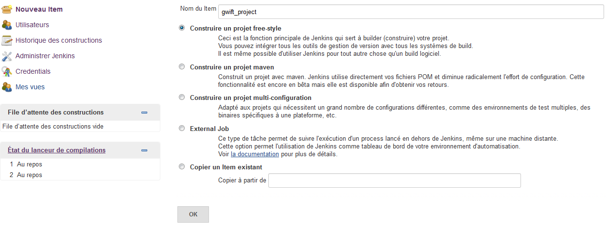
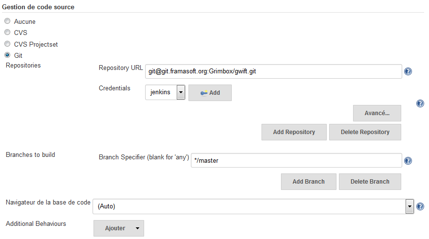
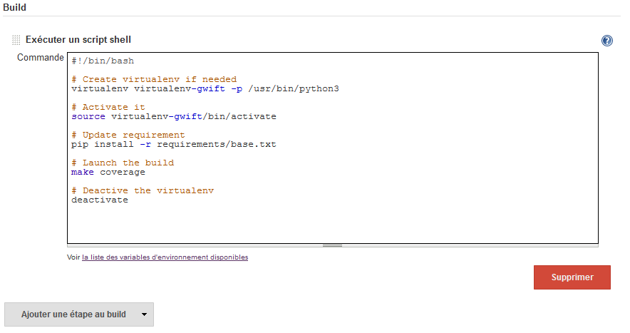
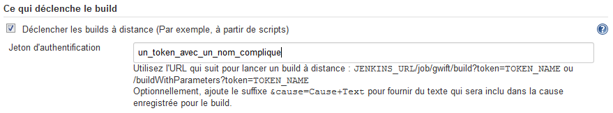
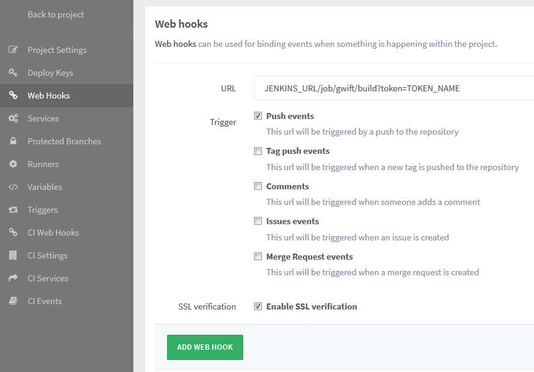

====================
Intégration continue
====================

Le but de l'intégration est continue est de nous permettre de tester automatiquement notre développement chaque fois que le code est mis à jour et ainsi éviter les régressions.

Ceci nécessite de mettre à jour régulièrement les tests et d'utiliser un serveur d'intégration. Dans notre cas, nous allons utiliser jenkins.

Nous considérons aussi que le code est hébergé sur gitlab (par exemple celui de `framasof <https://git.framasoft.org/>`_)

***********************
Installation de jenkins
***********************

Jenkins fournit des paquets d'installation pour presque tous les systèmes d'exploitation sur leur site: `https://jenkins-ci.org/ <https://jenkins-ci.org/>`_.

Par exemple, dans le cas de debian, il suffit de suivre les instructions sur `http://pkg.jenkins-ci.org/debian/ <http://pkg.jenkins-ci.org/debian/>`_

Comme nous utilisons git, il faut veiller à activer le plugin correspondant: `Git plugin <https://wiki.jenkins-ci.org/display/JENKINS/Git+Plugin>`_.
Ce dernier peut directement être installé depuis le panneau de gestion des plugins de jenkins.

********************
Création d'un projet
********************

Depuis la page principale de jenkins, on crée un nouveau projet en cliquant sur *Nouveau Item* et on donne un nom à notre nouveau projet:

Ensuite, on spécifie que le projet provient de git:

Finalement, on écrit le petit script permettant de lancer le build:

Et on sauve le tout.

*********************
Lien gitlab - jenkins
*********************

Pour que le build du projet que nous avons créé dans jenkins soit exécuté automatiquement, il est nécessaire d'autoriser le lancement du build via une url sur jenkins, cette dernière étant appelée depuis gitlab.

Dans jenkins, on se rend dans les propriétés du projet et on active le déclanchement du build à distance:

Attention à générer un jeton d'authentification suffisamment aléatoire pour éviter que n'importe qui ne lance le build. Par exemple avec uuid en python:

.. code-block:: python

    >>> import uuid
    >>> uuid.uuid4()
    UUID('097e547c-08b4-4d4f-a8e8-2a1cf03b8463')
    >>>

Ensuite, on crée un web hook dans gitlab:

Voilà, à chaque push sur gitlab, jenkins lancera le build du projet et exécutera les tests associés.

