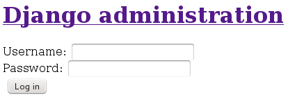

==================
Mise en production
==================

Le serveur que django met à notre disposition est prévu uniquement pour le développement.

Pour une mise ne production, il nous faut donc quelque chose de plus solide:

 * Nginx comme serveur principal
 * Gunicorn comme serveur d'application
 * PostgreSQL comme base de données
 * supervisor pour lancer notre application
 
Les points suivants décrivent les étapes nécessaires à la mise en place de ces outils.

***Remarque***: dans ce qui suit, les commandes exécutées en root seront précédées de $$$.
 
**********
PostgreSQL
**********

On commence par installer PostgreSQL.

Par exemple, dans le cas de debian, on exécute la commande suivante:

.. code-block:: shell

    $$$ aptitude install postgresql postgresql-contrib
    
Ensuite, on crée un utilisateur pour la DB:

.. code-block:: shell

    $$$ su - postgres
    postgres@gwift:~$ createuser --interactive -P
    Enter name of role to add: gwift_user  
    Enter password for new role: 
    Enter it again: 
    Shall the new role be a superuser? (y/n) n
    Shall the new role be allowed to create databases? (y/n) n
    Shall the new role be allowed to create more new roles? (y/n) n
    postgres@gwift:~$
    
Finalement, on peut créer la DB:

.. code-block:: shell

    postgres@gwift:~$ createdb --owner gwift_user gwift
    postgres@gwift:~$ exit
    logout
    $$$

************
environement
************

Préparation
===========

On prépare l'environement pour accueillir notre application django.

Il faut d'abords rajouter certains packets qui seront nécessaires pour compiler certains module python:

.. code-block:: shell

    $$$ aptitude install libpq-dev python3-dev

On créé un utilisateur dédié, pour limiter les accès au serveur dans le cas où notre application serait piratée.

.. code-block:: shell

    $$$ groupadd --system webapps
    $$$ useradd --system --gid webapps --shell /bin/bash --home /webapps/gwift gwift

Ensuite, on crée le repertoire où se trouvera notre application et on lui attribue le bon utilisatuer:

.. code-block:: shell

    $$$ mkdir -p /webapps/gwift
    $$$ chown gwift:webapps /webapps/gwift
    
Puis on crée notre environement virtuel:

.. code-block:: shell

    $$$ su - gwift
    gwift@gwift:~$ mkvirtualenv -p /usr/bin/python3 gwift
    Already using interpreter /usr/bin/python3
    Using base prefix '/usr'
    New python executable in gwift/bin/python3
    Also creating executable in gwift/bin/python
    Installing setuptools, pip...done.
    (gwift)gwift@gwift:~$ 

On peut maintenant cloner notre projet:

.. code-block:: shell

    (gwift)gwift@gwift:~$ git clone git@framagit.org:Grimbox/gwift.git
    
Et installer les dépendances:

.. code-block:: shell

    (gwift)gwift@gwift:~$ pip install -r requirements/production.txt
    

Le fichier production.txt contient les librairies pour gunicorn et PostgreSQL:

.. code-block:: txt

    -r base.txt

    gunicorn
    psycopg2

Configuration
=============

Il ne nous reste plus qu'à mettre à jour la DB. On commance par créer le fichier de configuration de l'application en production:

.. code-block:: shell

    (gwift)gwift@gwift:~$ touch gwift/gwift/settings/local.py

Et le contenu de local.py, avec la clé secrète et les paramètres pour se connecter à la DB:

.. code-block:: python

    from .production import *

    # SECURITY WARNING: don't run with debug turned on in production!
    DEBUG = False
    
    # SECURITY WARNING: keep the secret key used in production secret!
    SECRET_KEY = 'strong_secret_key'

    # Password validation
    # https://docs.djangoproject.com/en/1.9/ref/settings/#auth-password-validators
    AUTH_PASSWORD_VALIDATORS = [
        {
            'NAME': 'django.contrib.auth.password_validation.UserAttributeSimilarityValidator',
        },
        {
            'NAME': 'django.contrib.auth.password_validation.MinimumLengthValidator',
        },
        {
            'NAME': 'django.contrib.auth.password_validation.CommonPasswordValidator',
        },
        {
            'NAME': 'django.contrib.auth.password_validation.NumericPasswordValidator',
        },
    ]
    
    # DB
    DATABASES = {
        'default': {
            'ENGINE': 'django.db.backends.postgresql_psycopg2',
            'NAME': 'gwift',
            'USER': 'gwift_user',
            'PASSWORD': 'gwift user password',
            'HOST': 'localhost',
            'PORT': '',                      # Set to empty string for default.
        }
    }

Finalement, on peut mettre à jour la DB et créer un super utilisateur:

.. code-block:: shell

    (gwift)gwift@gwift:~$ python manage.py migrate
    (gwift)gwift@gwift:~$ python manage.py createsuperutilisater

Test
====

On peut tester si tout fonctionne bien en lancant le server avec django

.. code-block:: shell

    (gwift)gwift@gwift:~$ python manage.py runserver sever_name.com:8000
    
Et en se rendant sur server_name.com:8000/admin, on obtient:

Comme on peut le voir, il n'y a pas de mise en forme de la page car les fichiers statics ne sont pas encore servis. Il le seront pas nginx

Voir http://michal.karzynski.pl/blog/2013/06/09/django-nginx-gunicorn-virtualenv-supervisor/
Et http://tutos.readthedocs.org/en/latest/source/ndg.html

Ne pas oublier la génération des fichiers statics !

.. include:: production/postgresql.rst
.. include:: production/environment.rst
.. include:: production/gunicorn.rst
.. include:: production/nginx.rst

